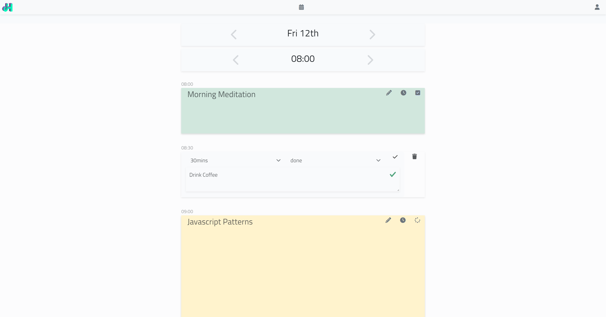

# Timeboxer

Timeboxer is a React/Redux/Laravel drag-and-drop todo application with visually adjustable time slots to fill an 8-hour day. It's designed to help manage your time effectively and focus on what truly matters. This happens to have been **Steve Jobs** goto method for todo management. 

[Demo](https://timebox.joehunter.dev)

## Features

- 📝 Drag and Drop: Easily organize your tasks with a user-friendly interface.
- 🌅 Time Management: Set specific time periods for tasks to improve productivity.
- 🧩 Task Prioritization: Prioritize your tasks based on urgency and importance.
- 🎨 API: The application includes an API with a well-defined data structure. 

## 🏁 Getting Started

To get started, simply clone the repository and follow the installation steps in the Installation section. 

## 💡 Installation

The application is built using Laravel and React. Here are the steps to set it up:

1. Clone the repository
2. Install `package.json`, `composer.json` dependancies. 
3. Create MySQL database and update `.env` file with your database credentials
4. `php artisan migrate` to create the database
5. `php artisan db:seed` to seed the database
6. See package.json for commands and `webpack.mix.js` for build settings.
7. `$ php artisan serve` run the app https://localhost:8000

